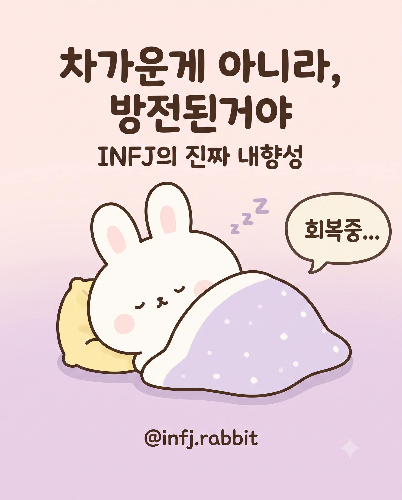

# 🎨 AI 인스타툰 만들기 실습 자료 저장소

안녕하세요! **[당신의 강의명 / 예: 누구나 쉽게 시작하는 AI 인스타툰 기획부터 작화까지]** 강의 수강생 여러분을 위한 실습 자료 저장소입니다.
 

본 저장소에는 Gemini의 맞춤형 AI(Gems)를 활용하여 나만의 인스타툰 제작 파이프라인을 구축하는 데 필요한 모든 소스 파일이 포함되어 있습니다.

## 🔗 관련 링크
* **유튜브 채널**: [코딩고스트](https://www.youtube.com/@codingghost941)
* **홈페이지**: [blackcrown.io](https://blackcrown.io)
* **인스타그램**: [@blackcrown.design.studio](https://www.instagram.com/blackcrown.design.studio) / [@coding.ghost](https://www.instagram.com/coding.ghost)
* **코딩-레벨-업**: [교보문고 바로가기](https://ebook-product.kyobobook.co.kr/dig/epd/ebook/E000011036353)

## 🌟 파이프라인 소개

이 실습에서는 두 명의 AI 어시스턴트(Gems)를 세팅하여 협업합니다.
1. **스토리 작가 `Bobby(바비)`** ✍️: 캐릭터를 분석하고, 스토리를 기획하여 작화용 텍스트 콘티(.md)를 작성합니다.
2. **그림 작가 `Jenie(제니)`** 🎨: 바비의 텍스트 콘티와 캐릭터 레퍼런스를 바탕으로 실제 4:5 비율의 인스타툰 일러스트를 컷별로 그려냅니다.

